# Neon outline options

**Chosen:** D6 (Dark) and W5 (White). "Current" below means the outline
before that choice.

Task 2.25: pick one option for each theme. Tell me the codes (for example
"D4 and W3"), or mix them ("D2's strength with D5's colour"). Every option is a
real render of the bottom bar on the Home tab. Colour, line width, glow width,
glow strength and the circle colour can be combined freely.

## Dark theme

| Code | What changes | Render |
|---|---|---|
| **D1** | Cyan `#00E5FF`, line 1.5 dp, glow 8 dp at 55% (current) |  |
| **D2** | Cyan, line 2 dp, glow 14 dp at 85% | 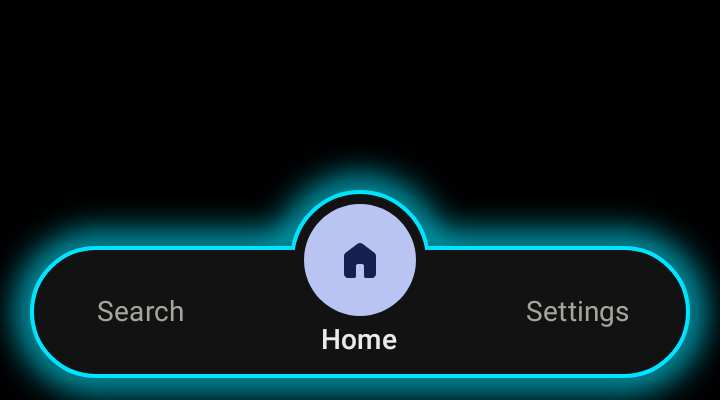 |
| **D3** | Cyan, line 1 dp, glow 5 dp at 35% | 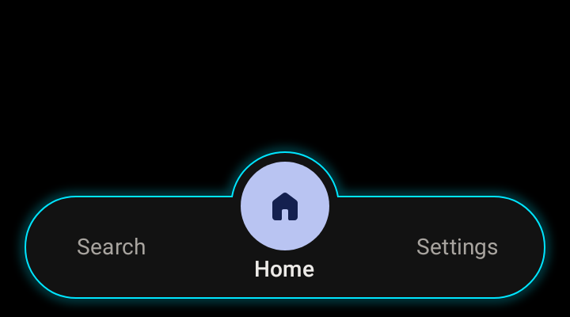 |
| **D4** | Current cyan, and the circle is cyan too (dark icon) | 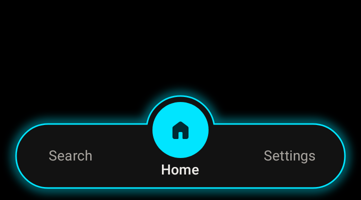 |
| **D5** | Magenta `#FF2BD6`, current strength | 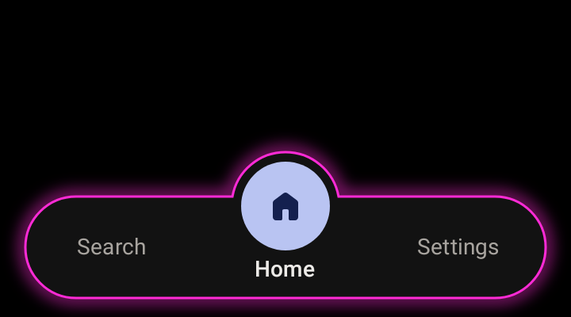 |
| **D6** | Violet `#B388FF`, current strength | 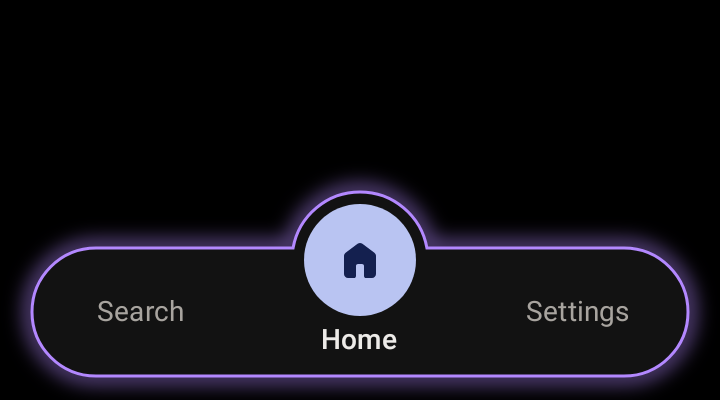 |
| **D7** | Acid green `#39FF14`, current strength | 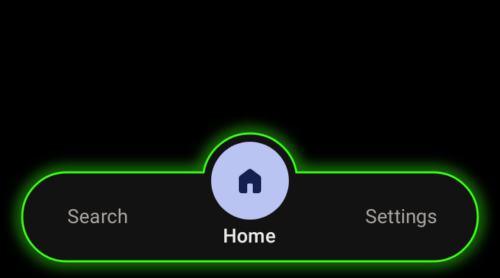 |
| **D8** | Amber `#FFB300`, current strength | 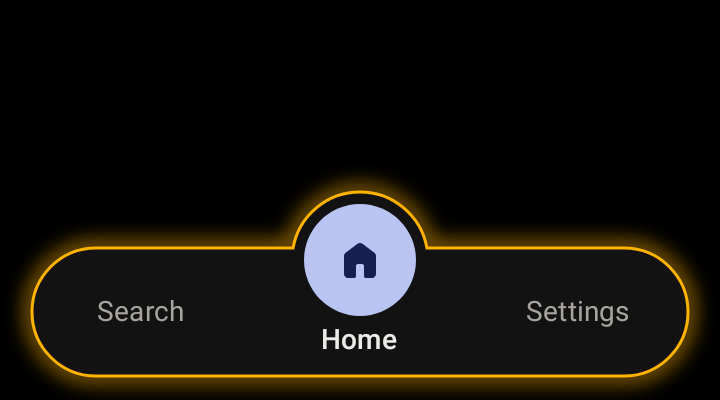 |

## White theme

| Code | What changes | Render |
|---|---|---|
| **W1** | Accent blue `#3F55B0`, line 1.5 dp, glow 8 dp at 55% (current) | 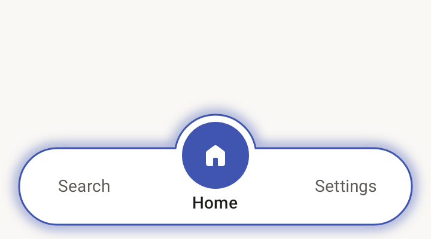 |
| **W2** | Blue, line 2 dp, glow 14 dp at 60% | 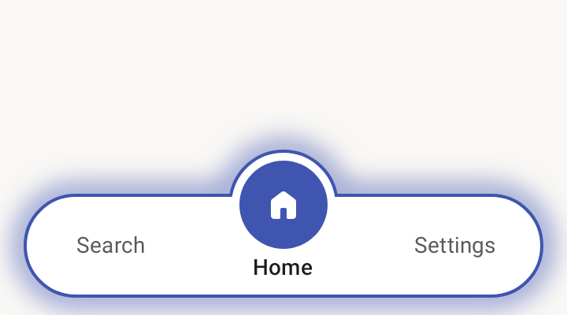 |
| **W3** | Deep cyan `#00ACC1`, current strength | 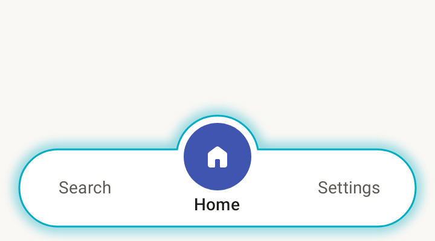 |
| **W4** | Magenta `#C51162`, current strength | 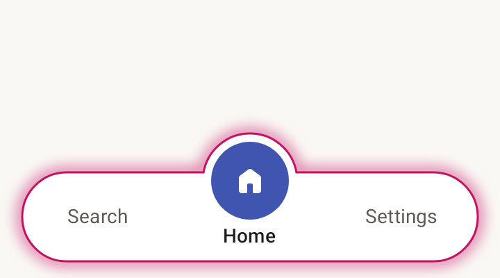 |
| **W5** | Violet `#651FFF`, current strength | 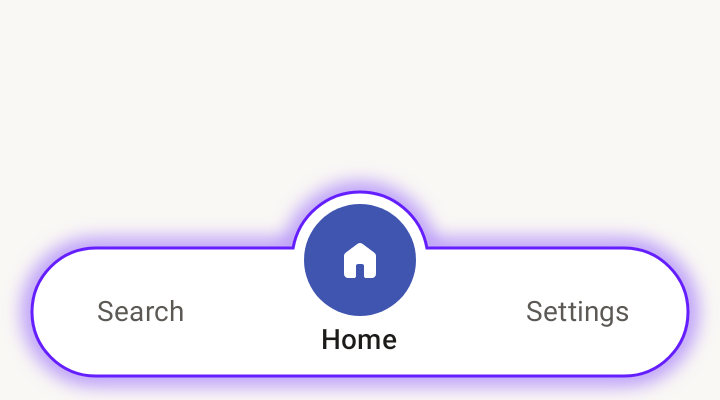 |
| **W6** | Blue line only, no glow | 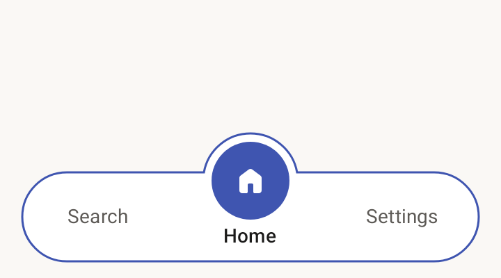 |

The glow is decorative (no text sits on it), so it has no contrast
requirement. The circle's icon keeps at least 4.5:1 against the circle in every option.
