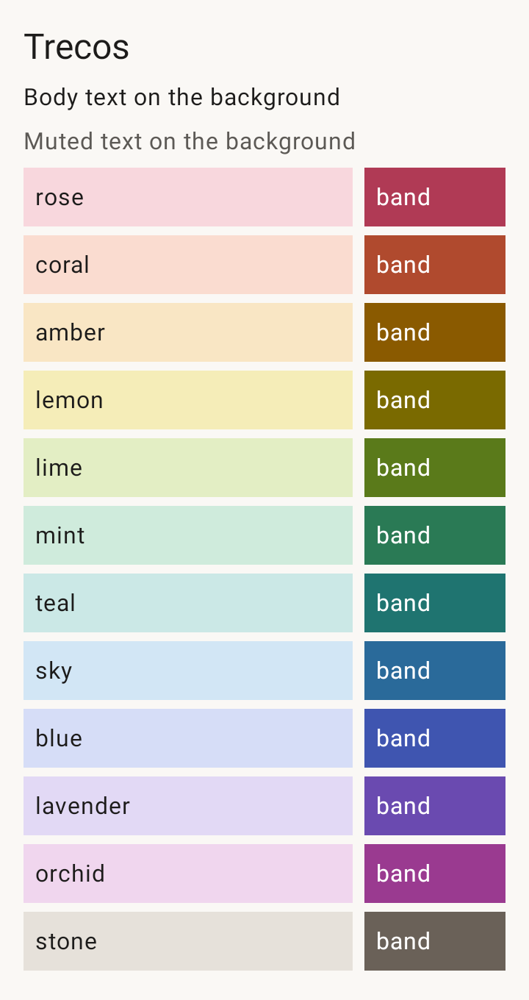
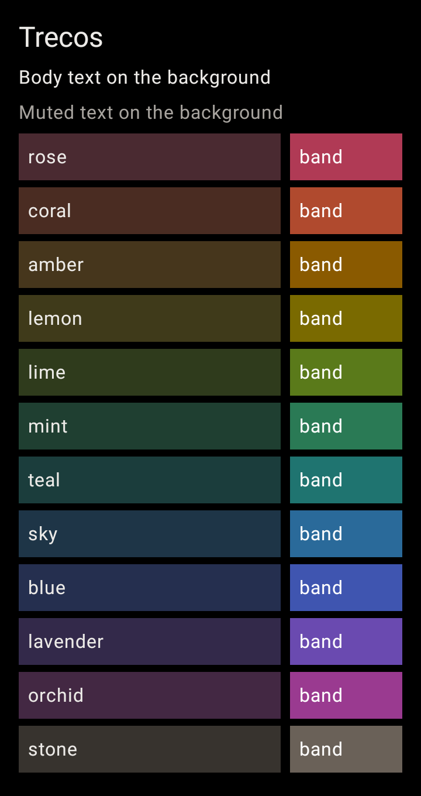
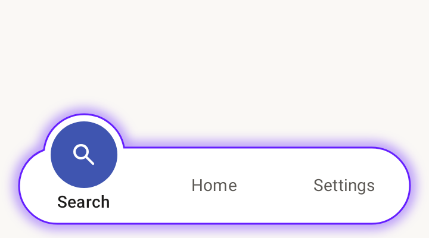
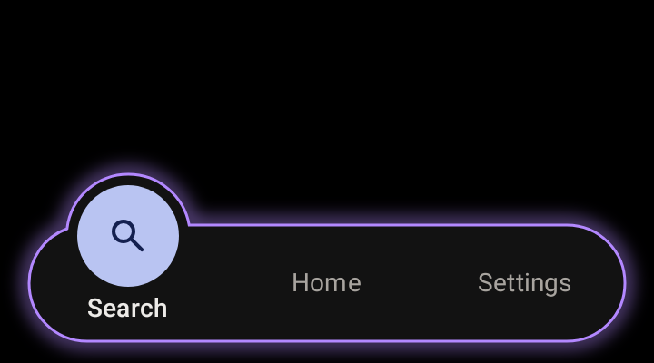
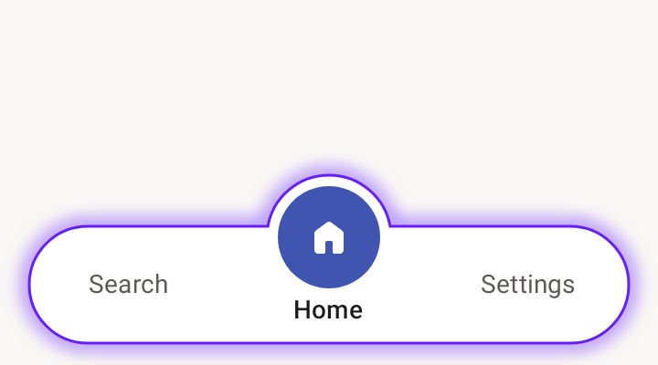
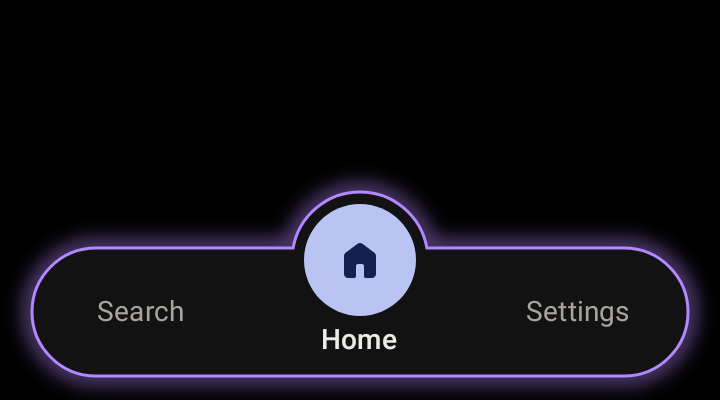
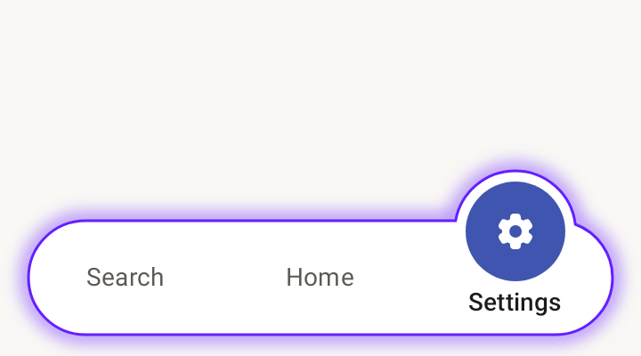
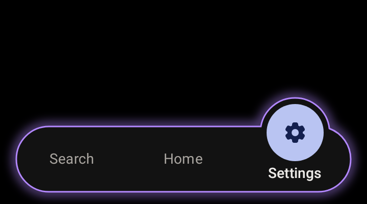
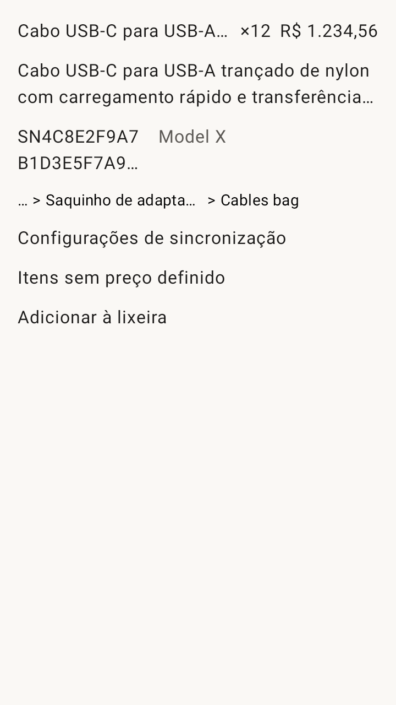
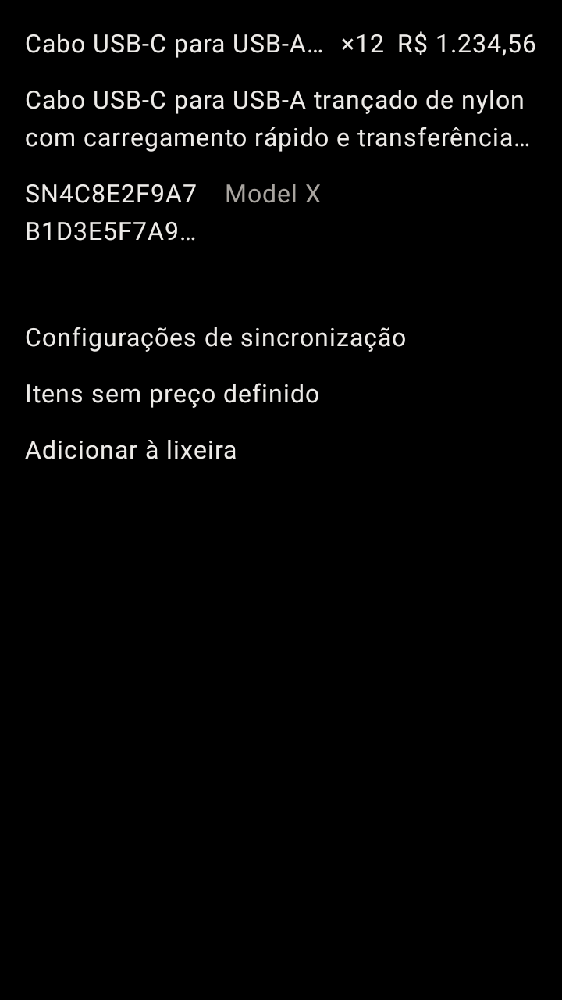

# Visual review

Every image on this page is a real render from the screenshot tests
(`./gradlew recordRoborazziDebug`), so it shows exactly what the app draws.
Open this file on GitHub to see the images. Contrast minimum: **4.5:1** (WCAG AA
for body text), enforced by `PaletteContrastTest` on every build.

## Themes and palette

| White | Dark |
|---|---|
|  |  |

Each row shows the colour's **tint** (the left block, with the theme's body
text on it; used for container top bars, headers and list stripes) and its
**band** (the right block, with white text; used behind the status bar for a
house).

### Theme tokens

| Pair | Colours | Contrast |
|---|---|---|
| White: text on background | `#1C1B1A` on `#FAF8F5` | 16.22 |
| White: muted text on background | `#5C5955` on `#FAF8F5` | 6.57 |
| White: text on surface | `#1C1B1A` on `#FFFFFF` | 17.20 |
| White: accent on background | `#3F55B0` on `#FAF8F5` | 6.31 |
| Dark: text on background | `#EDEBE8` on `#000000` | 17.65 |
| Dark: muted text on background | `#A8A49F` on `#000000` | 8.48 |
| Dark: text on surface | `#EDEBE8` on `#121212` | 15.74 |
| Dark: accent on background | `#B9C4F2` on `#000000` | 12.24 |

### Palette

White text is `#1C1B1A` (muted `#5C5955`); Dark text is `#EDEBE8` (muted `#A8A49F`).
Band text is white in both themes.

| Colour | Key (stored) | White tint | Dark tint | Band | Text on White tint | Muted on White tint | Text on Dark tint | Muted on Dark tint | White on band |
|---|---|---|---|---|---|---|---|---|---|
| Rose | `rose` | `#F8D7DD` | `#4A2A31` | `#B03A55` | 12.90 | 5.23 | 10.59 | 5.09 | 5.86 |
| Coral | `coral` | `#FADCD0` | `#4A2C22` | `#B04A2E` | 13.28 | 5.38 | 10.54 | 5.06 | 5.43 |
| Amber | `amber` | `#F9E6C4` | `#46361C` | `#8A5A00` | 14.04 | 5.69 | 9.78 | 4.70 | 5.93 |
| Lemon | `lemon` | `#F5EDB8` | `#3F3A1A` | `#7A6A00` | 14.49 | 5.87 | 9.64 | 4.63 | 5.40 |
| Lime | `lime` | `#E3EEC4` | `#2F3B1C` | `#5A7A1A` | 14.16 | 5.74 | 10.01 | 4.81 | 4.96 |
| Mint | `mint` | `#CFEBDC` | `#1F3F31` | `#2A7A55` | 13.57 | 5.50 | 9.73 | 4.67 | 5.23 |
| Teal | `teal` | `#CBE8E6` | `#1B3D3C` | `#1F7470` | 13.29 | 5.38 | 9.92 | 4.76 | 5.54 |
| Sky | `sky` | `#D2E6F5` | `#1E3547` | `#2A6A9A` | 13.41 | 5.43 | 10.66 | 5.12 | 5.79 |
| Blue | `blue` | `#D6DDF7` | `#252F4F` | `#3F55B0` | 12.73 | 5.16 | 11.04 | 5.30 | 6.69 |
| Lavender | `lavender` | `#E2D9F5` | `#33294A` | `#6A4AB0` | 12.68 | 5.13 | 11.34 | 5.44 | 6.52 |
| Orchid | `orchid` | `#F0D6EE` | `#432843` | `#9A3A90` | 12.74 | 5.16 | 10.87 | 5.22 | 6.21 |
| Stone | `stone` | `#E6E1DA` | `#37332E` | `#6A6158` | 13.22 | 5.36 | 10.53 | 5.06 | 6.06 |

Lowest ratio in the palette: **4.63:1**.

## Bottom bar

The bar floats with a neon outline instead of a shadow: a 1.5 dp line plus an
8 dp blurred glow at 55% opacity, following the bar and its bump. The glow is
decorative (no text sits on it), so it has no contrast requirement.

The colours were chosen from these options (task 2.25): D6 for Dark and W5 for White,
see [neon-options.md](neon-options.md).

| Theme | Glow colour |
|---|---|
| White | `#651FFF` (violet, W5) |
| Dark | `#B388FF` (violet, D6) |

| Tab | White | Dark |
|---|---|---|
| Search |  |  |
| Home |  |  |
| Settings |  |  |

## Text safety

The stress fixtures: a 200-character name next to a quantity and price, the
same name on two lines, a 40-character serial number next to its neighbour,
an eight-level path collapsed to its last two levels, and long Portuguese labels.

| White | Dark |
|---|---|
|  |  |

## Keeping this page current

Screenshots update themselves when baselines are re-recorded. The contrast
tables above were computed from `ColorTokens.kt` and `PaletteColor.kt`;
recompute them when a colour changes.
